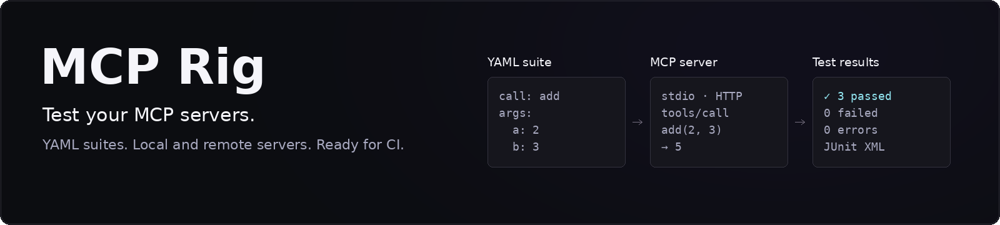
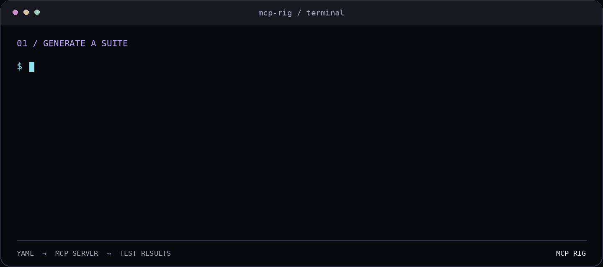

[](https://github.com/gorkemgul/mcp-rig/actions/workflows/ci.yml)
[](https://github.com/gorkemgul/mcp-rig/blob/main/LICENSE)
[](https://pypi.org/project/mcp-rig/)
[](https://pypi.org/project/mcp-rig/)
[](https://pypi.org/project/mcp-rig/)
[](https://github.com/gorkemgul/mcp-rig/issues?q=is%3Aissue%20is%3Aopen)
[](https://github.com/gorkemgul/mcp-rig/stargazers)

# MCP Rig

Deterministic, CI-friendly testing for Model Context Protocol servers.

Write the calls your MCP server must handle as a YAML suite, then run that
suite on every commit. MCP Rig starts the server, calls its tools, checks the
results, and reports in a format CI understands.

## Why MCP Rig?

[MCP Inspector](https://github.com/modelcontextprotocol/inspector) is the
official tool for trying a server by hand: you connect, click a tool, and read
the response. MCP Rig is for what comes next, making sure the server keeps
behaving that way:

- **Repeatable suites.** Cases live in YAML next to your code and run the same
  way locally and in CI.
- **Focused checks.** Expected errors, text, regular expressions, JSON paths,
  JSON Schema, latency limits, and full-response snapshots.
- **State, not just responses.** `verify` steps check what a call actually
  changed. `fault` loses a response on purpose, and opt-in retries show whether
  your tool applies its effect twice.
- **CI-ready output.** JUnit XML, clear exit codes, tag and name filters, and a
  GitHub Action.
- **Server checks without a suite.** `mcp-rig check` probes protocol behavior
  and flags weak tool definitions, including side-effecting tools that are
  unsafe to retry.

MCP Rig tests the tools of local stdio servers and of remote servers over
Streamable HTTP or SSE.

## Quick start

```bash
pipx install mcp-rig
mcp-rig check "python server.py"
mcp-rig init "python server.py" --output tests/mcp/server.yaml
mcp-rig run tests/mcp/server.yaml
```

`check` gives an immediate health report. `init` writes one starter case per
tool. Replace its placeholder arguments with real ones, add expectations, and
commit the suite. Then add one step to your workflow:

```yaml
- uses: gorkemgul/mcp-rig@v0.3.0
  with:
    suites: tests/mcp/
    junit: mcp-rig-results.xml
```

## CLI in action

Generate a suite from a server's tools, run a suite, and check a remote server
over HTTP:



The demo uses the repository's fixture server, locally and over Streamable
HTTP. Try it from a development checkout after completing the
[development setup](#development-setup):

```bash
mcp-rig init "python tests/fixtures/fixture_server.py" --output suite.yaml
mcp-rig run examples/fixture.yaml
python tests/fixtures/http_server.py streamable-http 8765 &
mcp-rig check http://127.0.0.1:8765/mcp --ignore param-no-description
```

## Installation

Install MCP Rig as an isolated command-line tool with
[pipx](https://pipx.pypa.io/):

```bash
pipx install mcp-rig
```

Or install it into the active Python environment with pip:

```bash
pip install mcp-rig
```

## Development setup

```bash
python3 -m venv .venv
.venv/bin/pip install -e ".[dev]"
source .venv/bin/activate
```

The `Makefile` runs the same checks as CI through `.venv/bin`, so they work
without an activated environment:

```bash
make dev       # create .venv and install the project with dev tools
make lint      # ruff
make test      # pytest
make examples  # run the fixture suite and the feature tour
make check     # mcp-rig check against the fixture server
```

The example suites start their servers with `python`. Without the environment
activated, that may resolve to an interpreter that lacks a compatible `mcp`
package. In that case the server exits during startup and MCP Rig reports
`suite setup: MCPError: Connection closed`. Add `--server-logs` to see the
server's error output.

## Generate a starter suite

Point `init` at your server to write one case per advertised tool:

```bash
mcp-rig init "python server.py" --output tests/mcp/server.yaml
mcp-rig run tests/mcp/server.yaml
```

Each case calls its tool with typed placeholders for the required parameters.
A placeholder is the schema's default, const, or first enum value when one
exists, and otherwise an empty value of the right type. The tool description is
kept as a comment, along with a `TODO` to replace the placeholders and add
expectations. Generated cases only require a successful call, so the suite runs
straight away.

Tools that look side-effecting are tagged `side-effect`. A tool counts as
side-effecting when its name starts with a verb such as `create` or `send`, or
when it is annotated `readOnlyHint: false` or `destructiveHint: true`. Leave
those cases out against a live server with `--exclude-tag side-effect`.

When `--output` points to another directory, the suite records the server's
working directory so relative paths in the command keep working. Without
`--output`, the suite is printed to stdout. `init` does not overwrite an
existing file unless `--force` is given.

## Run a suite

```bash
mcp-rig run examples/fixture.yaml
mcp-rig run examples/fixture.yaml --junit results.xml
```

Run several suites by passing more files or a directory. Directories are
searched recursively for `.yaml` and `.yml` files:

```bash
mcp-rig run tests/mcp/smoke.yaml tests/mcp/regression.yaml
mcp-rig run tests/mcp/ --junit results.xml
```

MCP Rig resolves and deduplicates suite paths, then runs them sequentially in
deterministic path order. A configuration or infrastructure error in one suite
does not prevent later suites from running. Batch runs print per-suite results
followed by aggregate suite and case counts. A JUnit file contains one
`<testsuite>` for every suite or invalid target beneath a shared `<testsuites>`
root.

### Test a remote server

Point a suite at an HTTP endpoint instead of a command:

```yaml
server:
  url: https://mcp.example.com/mcp
  headers:
    Authorization: "Bearer ${MCP_TOKEN}"

tests:
  - name: lists projects
    call: list_projects
    expect:
      is_error: false
```

`url` uses Streamable HTTP. Add `transport: sse` for servers that still use the
legacy SSE transport. The short form `server: https://mcp.example.com/mcp` works
when no headers are needed. `url` cannot be combined with `command`, `args`,
`env`, or `cwd`.

`${NAME}` in `url` and header values is replaced with the environment variable
`NAME` when the suite loads, so tokens stay out of committed files. A missing
variable is a configuration error. `check` and `init` accept a URL too, with
repeatable `--header` options:

```bash
mcp-rig check https://mcp.example.com/mcp --header "Authorization: Bearer $MCP_TOKEN"
mcp-rig init https://mcp.example.com/mcp --header "Authorization: Bearer $MCP_TOKEN" --output tests/mcp/remote.yaml
```

`init` never writes header values. It writes references such as
`${MCP_AUTHORIZATION}` and prints which variables to set.

A rejected connection reports its HTTP status, for example
`HTTP 401 Unauthorized`. After a transport error, a retry opens a new HTTP
session. MCP Rig cannot restart a remote server, so its state is never reset;
use `setup` and `teardown` steps for that. `--server-logs` only applies to
local servers.

### Filter cases and tags

Suites and individual cases can declare lowercase tags. Suite tags are
inherited by every case, and case tags are added to that inherited set:

```yaml
server: npx @playwright/mcp@latest
tags: [playwright]

tests:
  - name: opens homepage
    tags: [smoke, browser]
    call: browser_navigate
    args:
      url: https://example.com

  - name: captures screenshot
    tags: [slow]
    call: browser_take_screenshot
```

Select cases with case-sensitive shell-style name patterns or effective tags:

```bash
mcp-rig run suites/ --case "opens*"
mcp-rig run suites/ --tag playwright --tag smoke
mcp-rig run suites/ --exclude-tag slow
mcp-rig run suites/ --case "opens*" --tag smoke --exclude-tag flaky
```

Repeated `--case` patterns use OR semantics. Repeated `--tag` options use AND
semantics, so the case must carry every requested tag. A case is filtered out
when it carries any repeated `--exclude-tag` value. Name, included-tag, and
excluded-tag filters combine with AND semantics.

Filtered runs report selection separately from execution, for example
`3 selected, 7 filtered out`. Filtered-out cases are not counted as skipped
and are absent from JUnit; skipped remains reserved for selected cases that
could not run after an infrastructure error. If no cases match, MCP Rig does
not start a server, writes an empty report when `--junit` is requested, and
exits with code `2`.

### Snapshot complete tool responses

Use `snapshot: true` to compare the complete normalized tool result while still
combining it with focused expectations:

```yaml
server: npx @playwright/mcp@latest

tests:
  - name: opens homepage
    call: browser_navigate
    args:
      url: https://example.com
    expect:
      snapshot: true
      contains: Example Domain
```

For a suite named `browser.yaml` or `browser.yml`, MCP Rig stores snapshots in
`browser.snap.yaml` beside the suite. Structured content is stored as stable,
readable YAML; otherwise the complete text response is stored. Error state is
included, while latency is deliberately excluded.

An ordinary run never writes files. The first run therefore fails with a
missing-snapshot assertion. Create or intentionally refresh snapshots with:

```bash
mcp-rig run suites/ --update-snapshots
```

Review the generated `.snap.yaml` Git diff, then commit it with the suite. Later
ordinary runs fail when the response changes and include a unified diff in the
terminal and JUnit report. Snapshot differences return exit code `1`; malformed
or unwritable snapshot files return exit code `2`.

Snapshot updates compose with `--case`, `--tag`, and `--exclude-tag`. A filtered
update changes only selected cases and preserves every unselected entry. A
complete, unfiltered successful update also removes stale entries for cases
that no longer declare snapshots.

See the [real-world server examples](https://github.com/gorkemgul/mcp-rig/tree/main/examples) for
pinned suites that exercise Playwright MCP, the MCP Everything reference server, and the Time
MCP server. External examples are kept out of the main CI path and run in a separate manual and
weekly smoke workflow.

The [complete feature tour](https://github.com/gorkemgul/mcp-rig/tree/main/examples/feature-tour)
provides runnable local examples for every expectation, snapshots, tags and filters, server
configuration, batch runs, JUnit, diagnostics, and `check`. Start with the
[custom-server template](https://github.com/gorkemgul/mcp-rig/tree/main/examples/custom-server-template)
when testing your own server, and use the
[GitHub Actions example](https://github.com/gorkemgul/mcp-rig/tree/main/examples/ci) for CI.

A suite names the server and the tool calls to verify:

```yaml
server:
  command: python
  args: [path/to/server.py]

tests:
  - name: adds two numbers
    call: add
    args: {a: 2, b: 3}
    expect:
      contains: "5"

  - name: missing user returns an error
    call: get_user
    args: {user_id: 42}
    expect:
      is_error: true
      contains: "not found"
```

Each case expects a successful tool call unless it declares
`is_error: true`. Supported expectations are:

- `contains` / `not_contains`: require or forbid one string or a list of strings.
- `matches`: search response text with a Python regular expression.
- `max_latency_ms`: enforce an inclusive response-time limit.
- `json_path`: compare exact values through dotted mapping keys and numeric list indexes.
- `schema`: validate structured results with JSON Schema Draft 2020-12;
  document-local `#...` references are supported, while external references
  are rejected to keep evaluation offline.
- `snapshot`: compare the complete normalized result with the suite's committed
  `.snap.yaml` sidecar; the value must be `true`.

`is_error: true` accepts both an MCP tool result marked as an error and a
JSON-RPC protocol error returned for that tool call. Timeouts and closed
connections remain infrastructure errors.

JSON checks prefer MCP structured content and otherwise parse response text as
JSON. Each case may set a positive, finite `timeout_s`; the default is 30
seconds. A timeout is an infrastructure error, aborts further calls on the
shared session, and marks later cases as skipped. Set `after_timeout: continue`
at the top of a suite to keep running later cases on the same session after a
timeout. A case can override the suite setting with its own `after_timeout`, for
example to let one known-slow case time out without stopping the suite. A
closed connection still stops the suite.

Terminal and JUnit reports distinguish four states:

- passed: the call completed and every expectation matched;
- failed: the call completed but one or more expectations did not match;
- error: MCP Rig could not execute the call or suite reliably; and
- skipped: the case was not started after an infrastructure error.

`--junit PATH` writes CI-readable XML without creating missing parent
directories. Invalid targets and suite configuration are represented as
synthetic JUnit errors. Exit codes are `0` for success, `1` for assertion
failures only, and `2` for any configuration, infrastructure, or report-writing
error; code `2` takes precedence when a batch contains both kinds of failure.
Add `--server-logs` to expose every suite server's stderr while diagnosing
startup or tool behavior.

### Check server state, set up, and retry

A response can look correct while the server state is wrong. `verify` steps run
further tool calls on the same session after a case's call completes, and their
failures are reported with the case, prefixed `verify[N] <tool>:`. Suite-level
`setup` steps run once before the first case and `teardown` steps run once
after the last case. Steps are not counted as test cases. A failing setup step
skips every case, and a failing setup or teardown step is reported as a suite
error.

```yaml
server: python server.py
setup:
  - call: reset_records
teardown:
  - call: reset_records

tests:
  - name: idempotent create applies once
    call: create_record
    args: {name: invoice, idempotency_key: invoice-001}
    retry:
      attempts: 1
    expect:
      json_path: {name: invoice}
    verify:
      - call: count_records
        args: {name: invoice}
        expect:
          json_path: {records: 1}
```

Steps accept `call`, `args`, `expect`, and `timeout_s`, and use the same
expectations as cases, except `snapshot`.

MCP Rig does not retry calls by default. `retry.attempts` lets a case repeat its
identical call after an infrastructure error. Assertion failures and tool
errors are never retried. After a timeout the retry reuses the session; after a
closed connection MCP Rig first starts a fresh server process, so only state
kept outside that process survives. Add `rerun_setup: true` to `retry` to run
the suite's `setup` steps again on the new connection before the retried call.
This option requires setup steps and has no effect after a timeout. If setup
fails during the re-run, the case is an error. Terminal output lists each
failed attempt, and JUnit records `mcp-rig.attempts` and `mcp-rig.retried.N`
testcase properties.

Retries matter for tools with side effects. A tool can commit and then lose its
response, and the retry's JSON can pass `schema`, `json_path`, and `snapshot`
checks while the operation has happened twice. Check the resulting state with
`verify`, and set the expected count from the tool's contract: an unprotected
tool should produce two records and a tool with an idempotency key should
produce one. The key is a tool argument, not the JSON-RPC request ID, which
changes with every attempt.

### Lose a response on purpose

`fault` makes MCP Rig lose a call's response, so you can test retries against
your own server without changing it:

```yaml
- name: order is created once despite a lost response
  call: create_order
  args: {sku: A1, idempotency_key: order-1}
  fault: drop_response
  timeout_s: 2
  retry:
    attempts: 1
  verify:
    - call: count_orders
      expect:
        json_path: {count: 1}
```

MCP Rig relays every message between the client and the server. With a fault,
it forwards the `tools/call` request so the server executes it, then intercepts
the response:

- `drop_response` discards the response. The attempt times out after
  `timeout_s`, so keep it short, and the session stays open for the retry.
- `disconnect` discards the response and closes the connection. The retry
  reconnects: a local server starts as a fresh process, so only state kept
  outside that process survives, and a remote server gets a new HTTP session.

Only the first attempt is faulted; retries and `verify` steps run normally.
Without `retry`, the faulted attempt is an infrastructure error. Reports name
the injected fault, and JUnit records it as the `mcp-rig.fault` property. Faults
work over stdio and HTTP. The
[state and retries example](https://github.com/gorkemgul/mcp-rig/tree/main/examples/feature-tour/state-and-retries.yaml)
shows both faults against a ledger fixture: the unprotected tool creates a
duplicate, and the idempotent tool does not.

## Check a server without a suite

Run protocol checks and inspect tool-definition quality without writing YAML:

```bash
mcp-rig check "python path/to/server.py"
```

The command verifies that the server lists tools, returns an MCP tool error for
an unknown tool, and remains responsive after the negative call. It also warns
about missing or short descriptions, invalid input schemas, undocumented
parameters, and tool descriptions that are likely to be confused with each
other.

The `retry-unsafe` warning flags tools that look side-effecting, such as
`create_record`, `send_email`, or a tool annotated `readOnlyHint: false`, but
declare neither `idempotentHint: true` nor an idempotency-key parameter such as
`idempotency_key`. Clients retry calls whose responses are lost, so such a tool
may apply its effect twice.

Lint warnings are advisory by default. Use `--strict` to make them fail CI:

```bash
mcp-rig check "python path/to/server.py" --strict
```

Heuristic warnings can be wrong for a particular server. Silence a code
everywhere, or a code for one tool, with repeatable `--ignore` options:

```bash
mcp-rig check "python path/to/server.py" --strict \
  --ignore similar-tools \
  --ignore retry-unsafe:create_record
```

For `similar-tools`, either tool of the pair matches. Ignored warnings do not
count toward `--strict`, and the summary reports how many were ignored. A
pattern that matches nothing prints a warning, so stale ignores are noticed. An
unknown code is a usage error. The codes are `no-description`,
`short-description`, `invalid-schema`, `param-no-description`, `similar-tools`,
and `retry-unsafe`.

`--probe-invalid-args` calls every tool that declares required parameters with
an empty argument object and checks that the call is rejected. Use this option
only with development or test servers: a server that does not enforce its
declared schema could execute the tool body.

```bash
mcp-rig check "python path/to/server.py" --probe-invalid-args
```

Server stderr is hidden by default. Add `--server-logs` while diagnosing the
server:

```bash
mcp-rig check "python path/to/server.py" --server-logs
```

For `check`, exit code `0` means all protocol checks passed, `1` means a
protocol check failed or strict lint found warnings, and `2` means the command,
server process, connection, or teardown failed.

MCP Rig tests tools; resources and prompts are not covered yet.

Repository CI tests Python 3.11 through 3.13 and validates both wheel and
source distributions without publishing them.

## Run in GitHub Actions

Add one step after your server's dependencies are installed:

```yaml
- uses: gorkemgul/mcp-rig@v0.3.0
  with:
    suites: tests/mcp/
    junit: mcp-rig-results.xml
```

The action installs MCP Rig into an isolated environment and fails the job when
a suite fails. See the
[GitHub Actions example](https://github.com/gorkemgul/mcp-rig/tree/main/examples/ci)
for every input.
